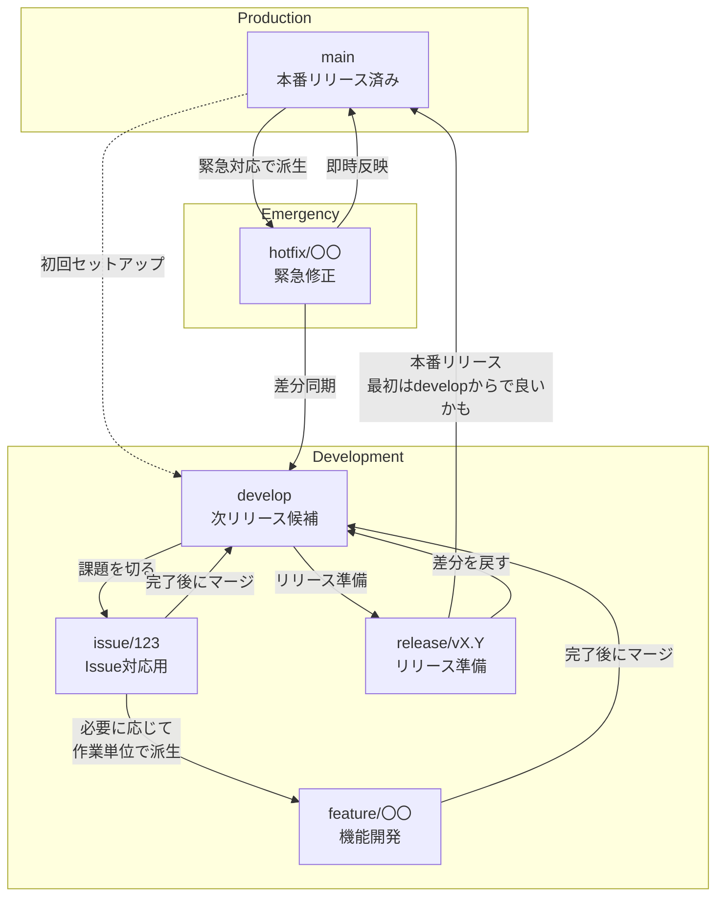

# AI/ML学習コミュニティへようこそ

こちらは2025/9/26にCodexに書かせた文章を手直ししたものです。
随時更新します。

## 🎯 目的
- 共にAI/MLの知識と実践力を高め、継続的にアウトプットする
- 最新技術や関連トレンドをキャッチアップし、個人のキャリアに活かす
- コラボレーションを通じて学習の幅を広げ、コミュニティとして成果を残す

## 🛠 主な活動

### 絶対やる！
- 非同期的(チャット中心)なコミュニケーションで情報交換と実践をする
- AIを使ったレビューやコーディングに慣れる

### 気が向いたらやる!
- 定期的な勉強会やハンズオンセッションの開催
- 論文読み会・ライトニングトークでの情報共有
- コンペティションや個人プロジェクトの成果発表
- モブリサーチやペアプログラミングでの実践的な取り組み

## 📌 基本ルール
- お互いをリスペクトし、前向きなフィードバックを心がける
- 会の活動や共有資料を外部へ出す際は、必ず関係者の合意を得る
- イベント参加が難しくなった場合は、早めに運営へ連絡する
- 個人情報や機密情報の取り扱いには十分注意する

## 💬 コミュニケーションガイドライン
- [Google Chat](https://chat.google.com/room/AAQAbM2IUD0?cls=7)でのオープンな会話を推奨
- 質問は歓迎。問いの背景や試したことを共有すると回答が得やすくなる → 具体的なルールは後日設定。Discussionを使用予定
- 議論が長くなりそうな場合はスレッド化・ドキュメント化して整理する

## 📕 リポジトリ作成ルール
勉強・題材・ゴールのテーマ単位で作成しようと思います。

```
画像分類
テキスト分析
```

大きい単位で作成し、困ったら後に分離していきましょう。
とは言っても、悩むくらいなら作って相談しましょう！やらない後悔より、やる後悔！

## 🌲 ブランチルール
私たちのOrganization全体では **GitFlow** に従ってブランチを運用します。「どの作業をどのブランチでやればいいの？」がすぐに判断できるよう、以下の流れを基本とします。迷ったらこの図とチェックリストを見てください。



### 基本ルールまとめ
1. **main**: 常にリリース可能な状態を保ちます。直接コミットはせず、リリースブランチやホットフィックスからマージします。
2. **develop**: 次にリリースしたい変更を集約するブランチです。通常の開発はここからスタートします。
3. **issue/**: `develop`から派生させ、GitHub Issue番号で管理する課題対応用ブランチです（例: `issue/123-fix-login`）。`main`・`develop`以外では最優先で運用し、Organization内のすべてのリポジトリで共通ルールとして運用します。必要に応じてこのブランチから`feature/`などを派生させます。
4. **feature/**: 新機能や改善を行うときに`issue/`ブランチから派生します。小さく区切り、終わったら`develop`へPRを出しましょう。Organization内での開発はこの流れを統一基準とします。
5. **release/**: リリース直前の調整用ブランチ。リリース作業時に`develop`から切り、最終確認後に`main`と`develop`へマージします。どのリポジトリでもこの手順を踏んでリリース品質を揃えます。
6. **hotfix/**: 本番環境で緊急対応が必要なときに`main`から派生させます。修正後は`main`と`develop`両方へマージして差分を揃えます。緊急対応でもOrganization全体で同じ手順を守り、混乱を避けましょう。

### 日々のチェックリスト
- 作業前に`main`と`develop`を最新化しましたか？
- 新しい作業は対応する`issue/`→`feature/`の順でブランチを切って進めていますか？（Organization内のすべてのリポジトリで共通）
- PRは小さく保ち、レビューアが確認しやすい粒度になっていますか？
- リリース前には`release/`ブランチで最終確認を行っていますか？
- 緊急修正後、`main`と`develop`の状態を揃えるのを忘れていませんか？

> 📎 図はGitFlowの基本構造を参考に作成しました。より詳しい説明は以下の資料がわかりやすいです。

- [Atlassian Gitflow ワークフローガイド](https://www.atlassian.com/ja/git/tutorials/comparing-workflows/gitflow-workflow)
- [GitFlow の紹介（Vincent Driessen）](https://nvie.com/posts/a-successful-git-branching-model/)

みなさんの参加と活発なアウトプットをお待ちしています！

---

# 以下はまだ決めていないことです！！！

コミュニティで議論中の役割分担や未確定事項、参考リソース、そしてサンプルリポジトリのアイデアについては、以下のドキュメントにまとめています。

- [コミュニティ運営メモ（役割・TODO・参考リソース）](./pending-decisions.md)
- [公開用AI/MLサンプルリポジトリアイデア集](./sample-repository-ideas.md)
